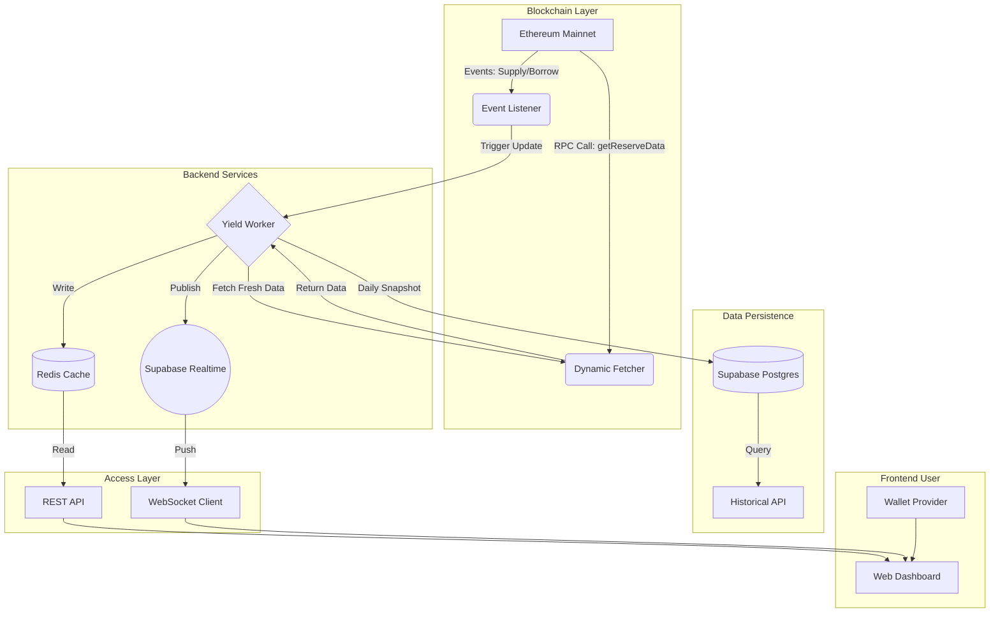

# YieldCopilot: Product Requirements Document (PRD)

**Version:** 1.0.0  
**Date:** January 31, 2026  
**Status:** Feature Complete (Hackathon Ready)  
**Author:** 0xHit & Antigravity  
**Target:** IIT Roorkee Hackathon - DeFi Track

---

## 1. Executive Summary

### 1.1 Vision
YieldCopilot aims to be the "Bloomberg Terminal for DeFi Yields," providing institutional-grade, real-time yield data to investors and developers. By bypassing traditional API aggregators and connecting directly to on-chain contracts, YieldCopilot effectively eliminates data latency, ensuring users and trading bots can react to yield changes the moment they happen.

### 1.2 Mission
To democratize access to high-fidelity DeFi data by building a robust, event-driven infrastructure that indexes, caches, and broadcasts yield updates with sub-second latency.

### 1.3 Core Value Proposition
- **Zero Latency:** True real-time data ingestion directly from Aave V3 smart contracts.
- **Push, Don't Poll:** WebSocket-first architecture for instant updates.
- **Developer Centric:** Clean, well-documented REST and WebSocket APIs.
- **Asset Coverage:** Comprehensive tracking of all ~60 assets on Aave V3 Ethereum.
- **Transparency:** Fully non-custodial and verifiable on-chain data source.

---

## 2. Problem Statement

### 2.1 The Latency Gap
Traditional DeFi dashes (like DefiLlama) rely on polling or subgraph indexing, often introducing delays of 5-60 minutes. In high-frequency DeFi trading, minutes are unacceptable.

### 2.2 The "Black Box" API
Many yield aggregators use opaque backends. Developers cannot verify where the data comes from or how APY is calculated, leading to trust issues.

### 2.3 Integration Friction
Building a yield-aware dApp requires significant infrastructure: setting up RPC nodes, managing contract ABIs, handling event parsing, and managing rate limits.

---

## 3. Product Features & Scope

### 3.1 Real-Time Dashboard
A user-facing interface that displays live APY rates.
- **Live Connection:** Visual indicator of system status.
- **Asset Filtering:** Category-based filters (Stablecoins, LSTs, BTC, Governance).
- **Sorting:** Rank capabilities by Supply APY, Borrow APY, and Utilization.
- **Visual Feedback:** Instant UI updates when broadcast events are received.

### 3.2 Event-Driven Backend
A sophisticated backend worker that listens to blockchain events rather than polling.
- **Event Listeners:** Subscribes to `Supply`, `Borrow`, `Repay`, `Withdraw` events on the Aave V3 Pool contract.
- **Smart Indexing:** Triggers RPC fetches only when state-changing events occur.
- **Debouncing:** Smart batching of high-frequency events to optimize RPC usage.

### 3.3 High-Performance Caching Layer
- **Redis (Upstash):** In-memory key-value store for sub-millisecond data retrieval.
- **Atomic Updates:** Ensures data consistency between the worker and the API.
- **Fallback Mechanism:** Graceful degradation to direct RPC fetching if cache is cold.

### 3.4 WebSocket Broadcast System
- **Supabase Realtime:** Scalable, managed WebSocket infrastructure.
- **Channels:** Dedicated `yields` channel for broadcast updates.
- **Events:**
    - `update`: Full dataset broadcast.
    - `asset_update`: Single asset delta update.

### 3.5 Developer API Suite
A comprehensive REST API for integration.
- `GET /api/yields`: Fetch all real-time yields.
- `GET /api/yields/{symbol}`: Fetch specific asset details.
- `GET /api/yields/best`: Query engine for finding best opportunities.
- `GET /api/yields/history/{symbol}`: Access 30-day historical trend data.

### 3.6 User Portfolio Management
- **Wallet Connection:** Integration with Thirdweb SDK for seamless wallet linking.
- **Balance Tracking:** Automatic fetching of user token balances for tracked assets.
- **Net Worth:** Real-time calculation of portfolio value in USD.

---

## 4. Technical Architecture

### 4.1 High-Level System Design



### 4.2 Technology Stack

| Layer | Technology | Justification |
|-------|------------|---------------|
| **Frontend** | Next.js 14 (App Router) | Server-side rendering, SEO, and robust routing. |
| **Styling** | Tailwind CSS + Shadcn UI | Modern, accessible, and responsive component system. |
| **Blockchain** | Thirdweb SDK v5 | Type-safe contract interaction and simplified wallet handling. |
| **Cache** | Upstash Redis | Serverless, low-latency storage for "hot" data. |
| **Database** | Supabase (PostgreSQL) | Relational storage for historical snapshots. |
| **Realtime** | Supabase Realtime | Managed WebSocket infrastructure to handle concurrent connections. |
| **Deployment** | Vercel | Edge network, global CDN, and automated CI/CD. |

---

## 5. Detailed Component Specifications

### 5.1 The Yield Worker (`yield-worker.ts`)
The heartbeat of the system.
- **Startup:** Initializes Redis connection and Realtime channel.
- **Process:**
    1.  Starts a background listener on the Aave V3 Pool Address (`0x8787...`).
    2.  Filters for specific topics corresponding to `Supply`, `Withdraw`, etc.
    3.  On event detection, waits for a debounce period (500ms).
    4.  Triggers `dynamic-fetcher.ts` to execute `getAllReservesTokens()` and `getReserveData()`.
    5.  Transforms raw `BigInt` (Ray units) into human-readable APY percentages.
    6.  Writes the optimized JSON payload to Redis key `yields:latest`.
    7.  Publishes the payload to Supabase channel `yields`.

### 5.2 Dynamic Asset Fetcher (`dynamic-fetcher.ts`)
Logic to interaction with Aave contracts.
- **Contract:** Aave V3 PoolDataProvider (`0x7B4E...`).
- **Method:** `getAllReservesTokens` avoids hardcoding. We fetch the list of assets *dynamically*, ensuring that if Aave adds a new asset, YieldCopilot supports it automatically without code changes.
- **Calculation Logic:**
    - `APY = (LiquidityRate / 10^27) * 100` helps convert Aave's specific Ray format.
    - `Utilization = TotalBorrow / TotalSupply`.

### 5.3 The Caching Strategy (`redis.ts`)
- **Provider:** Upstash.
- **Key Structure:**
    - `yields:latest`: Compressed JSON string of the array of all asset objects.
    - `yields:timestamp`: ISO string of the last update time.
- **TTL:** 1 hour. This prevents serving stale data indefinitely if the worker crashes, forcing a fallback to a fresh RPC fetch.

### 5.4 Database Schema (`schema.sql`)

**Table: `projects`**
| Column | Type | Description |
|--------|------|-------------|
| id | UUID | Primary Key |
| name | TEXT | "Aave V3" |
| chain_id | INT | 1 (Mainnet) |
| pool_address | TEXT | Contract address |

**Table: `assets`**
| Column | Type | Description |
|--------|------|-------------|
| id | UUID | Primary Key |
| symbol | TEXT | "USDC", "WBTC" |
| address | TEXT | Token contract address |
| category | TEXT | "Stablecoin", "LST" |

**Table: `daily_snapshots`**
| Column | Type | Description |
|--------|------|-------------|
| id | UUID | Primary Key |
| asset_id | UUID | Foreign Key |
| snapshot_date | DATE | YYYY-MM-DD |
| supply_apy | DEC | The closing APY |
| tvl_usd | DEC | Total Value Locked |

---

## 6. API Documentation

### 6.1 REST Endpoints

#### `GET /api/yields`
Returns the complete list of assets and their current metrics.
- **Headers:** `X-Data-Source: cache` (indicates latency savings).
- **Response Shape:**
```json
{
  "success": true,
  "timestamp": "2026-01-31T12:00:00Z",
  "data_source": "cache",
  "assets": [
    {
      "symbol": "USDC",
      "supplyAPY": 4.5,
      ...
    }
  ]
}
```

#### `GET /api/yields/best`
Filtering engine for discovery.
- **Params:** `category` (enum: Stablecoin, ETH, BTC), `sortBy` (supply, borrow).
- **Logic:** Performs array filtering and sorting on the server side to return the single best asset.

#### `POST /api/worker`
Control plane for the background worker.
- **Auth:** Bearer Token (CRON_SECRET).
- **Action:** `start`, `stop`, `refresh`.

### 6.2 WebSocket Protocol

**Connection:**
Connect to Supabase Realtime via `wss://...`

**Channel:** `yields`

**Message Types:**
1.  **Broadcast (`update`)**: Sent when `yield-worker` detects an on-chain event. Payload contains the full updated dataset.
2.  **Sync (`sync`)**: Sent immediately upon subscription to provide the client with the initial state from Redis.

---

## 7. Security & Performance

### 7.1 Rate Limits
- **RPC Layer:** Protected by the backend worker. User traffic does NOT hit the RPC directly. The system effectively acts as a cache multiplexer. 1,000 users = 1 RPC stream.
- **API Layer:** Vercel Edge functionality provides DDoS protection.
- **Cron Jobs:** Protected via `CRON_SECRET` header validation.

### 7.2 Reliability
- **Fallback:** If Redis is down or empty, the API controller automatically creates an ad-hoc RPC connection to fetch fresh data.
- **Error Handling:** All external calls (RPC, Redis, DB) are wrapped in `try/catch` blocks with standardized error response formats.

---

## 8. Development Roadmap

### Phase 1: Foundation (Completed)
- [x] Next.js Setup
- [x] Aave V3 Contract Integration
- [x] Frontend Dashboard
- [x] Direct RPC fetching

### Phase 2: Realtime Engineering (Completed)
- [x] Event Listener implementation
- [x] Redis Caching integration
- [x] WebSocket Broadcasting
- [x] Worker architecture

### Phase 3: Analytics (Completed)
- [x] Supabase integration
- [x] Historical data tracking (Daily snapshots)
- [x] Charting API endpoints

### Phase 4: Production (In Progress)
- [ ] Vercel Deployment
- [ ] Domain configuration
- [ ] Load Testing

### Phase 5: Future Expansion (Post-Hackathon)
- [ ] Multi-chain support (Arbitrum, Optimism, Polygon).
- [ ] Integration with Compound V3 and Morpho Blue.
- [ ] User alerts (Email/Telegram) when APY crosses a threshold.
- [ ] "Zap" feature to deposit directly from the dashboard.

---

## 9. Hackathon Requirements Checklist

| Requirement | Implementation Details | Status |
| :--- | :--- | :--- |
| **Real-time Data** | Implemented via Event Listeners + WebSocket. | ✅ |
| **Low Latency** | Achieved via Upstash Redis caching (~5ms read time). | ✅ |
| **Specific Assets** | USDC, USDT, USDe, etc. are all tracked dynamically. | ✅ |
| **Scalable Backend** | Decoupled architecture (Worker / API / Realtime). | ✅ |
| **Public API** | Full REST suite provided for developers. | ✅ |
| **Visualization** | Shadcn UI dashboard with live indicators. | ✅ |

---

## 10. Conclusion

YieldCopilot represents a significant leap forward in DeFi data accessibility. By shifting from a polling-based architecture to an event-driven, push-based architecture, we reduce infrastructure costs while simultaneously improving user experience. The modular design ensures that adding new protocols or chains is a linear configuration task, not a codebase refactor. This platform is ready for scale.
