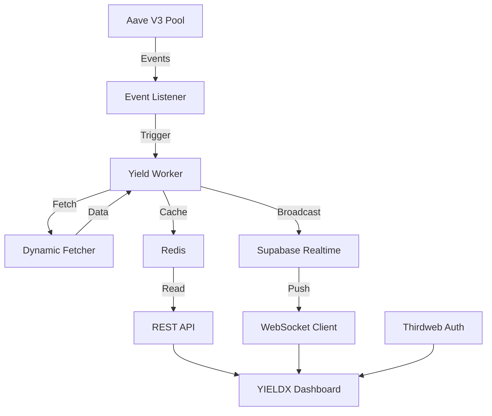

# YIELDX: Product Requirements Document (PRD)

**Version:** 2.0.0  
**Date:** January 31, 2026  
**Status:** Planning Phase  
**Author:** 0xHit & Antigravity  
**Rebrand:** YieldCopilot → YIELDX

---

## 1. Executive Summary

### 1.1 Vision
YIELDX transforms DeFi yield tracking from a utilitarian dashboard into an **immersive, educational, and visually stunning experience**. By combining institutional-grade real-time data with cutting-edge interface design, YIELDX makes decentralized finance accessible to beginners while satisfying the aesthetic demands of modern web users.

### 1.2 Mission  
To democratize DeFi through **radical simplicity** and **visual excellence**, creating an interface that:
- Abstracts blockchain complexity behind beautiful interactions
- Educates users through embedded content rather than documentation
- Builds trust through transparency and premium aesthetics

### 1.3 The Transformation
| Aspect | YieldCopilot | YIELDX |
|--------|--------------|--------|
| Theme | Dark/utilitarian | Light pastel glassmorphism |
| First Impression | Standard dashboard | Immersive eye animation landing |
| Onboarding | Wallet connect popup | "Portal" experience with social login |
| Education | External docs | Instagram-style embedded video feed |
| Visual Language | Functional | Premium, animated, tactile |
| Cursor | Native OS | Custom glowing follow cursor |
| Scrolling | Standard | Parallax helix backgrounds |

---

## 2. Target Audience

### 2.1 Primary: DeFi Beginners
- **Age:** 18-35
- **Crypto Experience:** Holds assets on centralized exchanges, curious about DeFi
- **Pain Points:**
  - Intimidated by wallet setup (seed phrases)
  - Confused by APY calculations
  - Overwhelmed by existing DeFi interfaces
- **Needs:**
  - One-click onboarding (Google login)
  - Visual explanations of yield mechanisms
  - Clear risk indicators

### 2.2 Secondary: Yield Optimizers
- **Profile:** Active DeFi users seeking best rates
- **Needs:**
  - Real-time APY comparison
  - Multi-protocol view
  - Quick deposit/withdraw actions

---

## 3. Core Features

### 3.1 Immersive Landing Experience

#### Eye Animation Portal
- **Behavior:** Dual eye SVG that tracks mouse movement
- **Eyelid Mechanics:** 
  - Eyes remain closed by default
  - Eyelids gradually open as cursor approaches "Enter" button
  - Proximity radius: 300px
  - Animation speed: 0.02 lerp factor (slow/organic)
- **Hover State:** Hearts appear in pupils when hovering Enter button
- **Purpose:** Creates memorable first impression, signals "something different"

#### Custom Cursor
- 60px glowing ring with 6px center dot
- Smooth physics-based following (0.08 easing)
- Context-aware states (default, hover, click)
- Hides native cursor globally

### 3.2 Pastel Glassmorphism Design System

#### Color Philosophy
The light palette evokes:
- **Trust** through warmth and openness
- **Sophistication** through carefully balanced pastels
- **Premium feel** through glass effects and subtle shadows

#### Token Definitions
```css
/* Backgrounds */
--cream: #FDF8F3;           /* Primary canvas */
--blush: #F8D8D8;           /* Warm accent */
--lavender: #E8E0F0;        /* Key brand color */
--mint: #E0F5E8;            /* Positive/growth */
--sky: #E0F0F8;             /* Information */
--peach: #F8E8E0;           /* Attention */
--lilac: #F0E8F8;           /* Secondary */

/* Text */
--text-primary: #2D2A32;    /* High contrast */
--text-secondary: #5A4A42;  /* Body copy */
--text-muted: #8A7A72;      /* Subtle */

/* Effects */
--glass-bg: rgba(255, 255, 255, 0.6);
--glass-border: rgba(0, 0, 0, 0.08);
--glow-lavender: rgba(183, 176, 249, 0.6);
```

### 3.3 Three.js Helix Glass Background

#### Implementation
- Double helix of floating glass panels
- Rotates slowly as user scrolls
- Each panel has:
  - `MeshPhysicalMaterial` with transmission
  - Lavender tint
  - Reflections from environment map
  
#### Performance
- WebGL with fallback to static gradient
- Target: 60fps on mid-range devices
- Lazy loaded after initial content paint

### 3.4 Bento Grid Dashboard

#### Layout Philosophy
"Everything visible, nothing overwhelming"

#### Grid Composition
| Block | Size | Content |
|-------|------|---------|
| Portfolio Master | 2×2 | Total value, sparkline chart |
| USDC | 1×1 | Current APY, 24h change |
| USDT | 1×1 | Current APY, 24h change |
| USDe | 1×1 | APY + "How it works" tooltip |
| crvUSD | 1×1 | APY + health indicator |
| AAVE | 1×1 | Supply/Borrow rates |
| Quick Actions | 2×1 | Deposit, Withdraw, Swap |
| Education Peek | 1×2 | Video thumbnail with CTA |

#### Micro-Interactions
- **Tilt Cards:** 3D perspective follows mouse (14°/18° max)
- **Glow Borders:** Light beam follows cursor on hover
- **Flip Reveal:** Tap/click to see detailed metrics

### 3.5 Instagram-Style Educational Feed

#### UX Pattern
- Full-viewport vertical scroll
- Snap to each video
- Autoplay when 60%+ visible
- Pause when scrolled away

#### Content Strategy
Videos for each asset:
1. **USDC vs USDT** — Backing mechanisms explained
2. **Understanding USDe** — Ethena's delta-neutral strategy
3. **crvUSD & LLAMMA** — Soft liquidation visualization
4. **AAVE Lending** — Supply vs Borrow APY
5. **Yield Farming 101** — Risk/reward basics

### 3.6 Frictionless Onboarding

#### Social Login Flow (Thirdweb SDK v5)
1. User clicks "Continue with Google"  
2. OAuth handshake completes
3. In-App Wallet generated (non-custodial)
4. Upgraded to Smart Account (ERC-4337)
5. Gas fees sponsored (Paymaster)

**Result:** User has functional DeFi wallet without ever seeing:
- Seed phrases
- Gas fee calculations  
- Network switching prompts

---

## 4. Technical Architecture

### 4.1 Stack

| Layer | Technology | Purpose |
|-------|------------|---------|
| Framework | Next.js 16 (App Router) | SSR, routing, optimizations |
| Styling | Tailwind CSS 4 | Utility-first, design tokens |
| 3D Graphics | Three.js + R3F | Helix background, effects |
| Animations | Framer Motion | Page transitions, gestures |
| Blockchain | Thirdweb SDK v5 | Wallet, contracts, auth |
| Real-time | Supabase Realtime | WebSocket yield updates |
| Cache | Upstash Redis | Hot data, rate limiting |
| Deployment | Vercel | Edge, CI/CD |

### 4.2 Component Architecture

```
┌─────────────────────────────────────────────────────────┐
│                    App Shell                            │
│  ┌───────────────────────────────────────────────────┐  │
│  │  Cursor Provider (Global mouse tracking)          │  │
│  │  ┌─────────────────────────────────────────────┐  │  │
│  │  │  Theme Provider (Design tokens)             │  │  │
│  │  │  ┌───────────────────────────────────────┐  │  │  │
│  │  │  │  Thirdweb Provider (Wallet state)     │  │  │  │
│  │  │  │  ┌─────────────────────────────────┐  │  │  │  │
│  │  │  │  │  Yield Context (Real-time data) │  │  │  │  │
│  │  │  │  │  ┌───────────────────────────┐  │  │  │  │  │
│  │  │  │  │  │        Page Content       │  │  │  │  │  │
│  │  │  │  │  └───────────────────────────┘  │  │  │  │  │
│  │  │  │  └─────────────────────────────────┘  │  │  │  │
│  │  │  └───────────────────────────────────────┘  │  │  │
│  │  └─────────────────────────────────────────────┘  │  │
│  └───────────────────────────────────────────────────┘  │
└─────────────────────────────────────────────────────────┘
```

### 4.3 Data Flow



---

## 5. Asset-Specific Requirements

### 5.1 USDC & USDT

| Attribute | Specification |
|-----------|---------------|
| Visual | Blue (USDC) / Green (USDT) tint on cards |
| Data | Supply APY, Total Supplied, 24h Change |
| Education | "Fiat-backed stablecoin" badge |
| Risk Level | Low (green indicator) |

### 5.2 USDe (Ethena)

| Attribute | Specification |
|-----------|---------------|
| Visual | Cyan accent, "Synthetic" badge |
| Data | APY, Funding Rate, Back Ratio |
| Education | Required tooltip: "Yield from ETH staking + perp shorts" |
| Risk Level | Medium (yellow indicator) |

### 5.3 crvUSD (Curve)

| Attribute | Specification |
|-----------|---------------|
| Visual | Rainbow/Magenta accent |
| Data | APY, Health Factor, Liquidation Band |
| Education | LLAMMA soft liquidation explainer |
| Risk Level | Medium (visual health bar) |

### 5.4 AAVE Supply

| Attribute | Specification |
|-----------|---------------|
| Visual | Purple (Aave brand) |
| Data | Supply APY vs Borrow APY (clear separation) |
| Education | Ghost mascot as guide |
| Risk Level | Low (established protocol) |

---

## 6. Video Assets Reference

| File | Content | Duration |
|------|---------|----------|
| `Crypto_Coin_Animation_Generation.mp4` | 3D coin renders | ~2min |
| `Recording 2026-01-31 181307.mp4` | UI reference #1 | ~4min |
| `Recording 2026-01-31 181453.mp4` | UI reference #2 | ~3min |
| `Recording 2026-01-31 230212.mp4` | Animation reference | ~2min |
| `Recording 2026-01-31 230631.mp4` | Full flow demo | ~5min |

---

## 7. Success Metrics

### 7.1 User Engagement
- **Time on Landing:** > 10 seconds (eye animation engagement)
- **Scroll Depth:** > 80% of About page
- **Video Completion:** > 40% watch full videos

### 7.2 Conversion
- **Wallet Connect Rate:** > 30% of visitors
- **Social Login Preference:** > 70% choose Google over wallet

### 7.3 Technical
- **LCP:** < 2.5 seconds
- **Animation FPS:** Consistent 60fps
- **WebSocket Stability:** > 99.9% uptime

---

## 8. Timeline

| Phase | Duration | Deliverables |
|-------|----------|--------------|
| Foundation | 1 day | Design tokens, cursor, glass panels |
| Landing | 1 day | Eye animation, enter flow |
| Core Animations | 2 days | Helix, liquid bg, tilt/glow cards |
| Dashboard | 1 day | Bento grid, asset cards |
| About Page | 1 day | Helix scroll, SwipeButton |
| Education | 1 day | Video feed, autoplay |
| Polish | 1 day | Performance, responsive |

**Total: 8 days to production-ready**

---

## 9. Appendix: Animation Specifications

### Framer Motion Presets

```typescript
// Page transitions
export const pageTransition = {
  initial: { opacity: 0, y: 20 },
  animate: { opacity: 1, y: 0 },
  exit: { opacity: 0, y: -20 },
  transition: { duration: 0.4, ease: [0.4, 0, 0.2, 1] }
};

// Card hover
export const cardHover = {
  scale: 1.02,
  transition: { type: "spring", stiffness: 400, damping: 25 }
};

// Glow pulse
export const glowPulse = {
  opacity: [0.5, 1, 0.5],
  transition: { duration: 2, repeat: Infinity }
};
```

### Three.js Performance Config

```typescript
// Helix renderer settings
const renderer = new THREE.WebGLRenderer({
  antialias: true,
  alpha: true,
  powerPreference: "high-performance"
});
renderer.setPixelRatio(Math.min(window.devicePixelRatio, 2));
```
